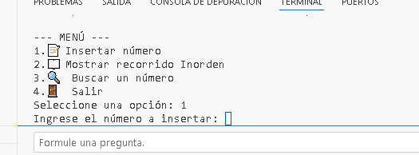
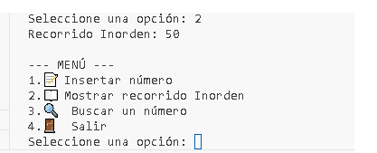
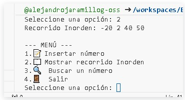
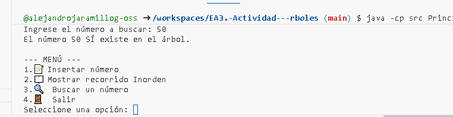
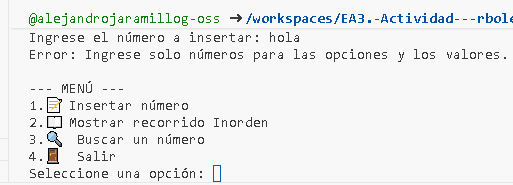

🌳 Implementación de un Árbol Binario de Búsqueda en Java

## 🎯 Objetivo del Proyecto
Implementar un Árbol Binario de Búsqueda (ABB) que permita a los estudiantes comprender cómo se organizan los datos de manera jerárquica y cómo se realizan las operaciones de inserción, búsqueda y recorrido (Inorden) en Java.

## 💡 ¿Qué es un Árbol Binario de Búsqueda (ABB)?
Un Árbol Binario de Búsqueda (ABB) es una estructura de datos jerárquica compuesta por **nodos**, donde cada nodo tiene a lo sumo dos hijos: uno a la izquierda y otro a la derecha.

La clave de un ABB es su regla de ordenamiento, que garantiza una búsqueda eficiente:
* **Regla de Inserción:** Para cualquier nodo:
    * Todos los valores en su subárbol **izquierdo** son **menores** que el valor del nodo.
    * Todos los valores en su subárbol **derecho** son **mayores** que el valor del nodo.

## ⚙️ Estructura del Código y Funcionalidades

El proyecto se implementó usando tres clases principales dentro de la carpeta `src/`:

1.  **`Nodo.java`**: Define la estructura fundamental de cada elemento, que contiene el `valor` (entero) y las referencias a los nodos `izquierda` y `derecha`.
2.  **`ArbolBinario.java`**: Contiene la lógica recursiva para las operaciones del ABB:
    * **Insertar**: Mantiene el orden del ABB (menores a la izquierda, mayores a la derecha).
    * **Buscar**: Utiliza la lógica del ABB para encontrar un número eficientemente.
    * **Recorrido Inorden**: Un método que visita los nodos en el orden **Izquierda -> Raíz -> Derecha**, imprimiendo los números de forma **ordenada**.
3.  **`Principal.java`**: Contiene el método `main` y el menú de consola que permite la interacción con el usuario.

## 🛠️ Instrucciones de Ejecución

Para ejecutar el programa desde la terminal:

1.  **Compila** todos los archivos Java desde la carpeta raíz del proyecto:
    ```bash
    javac src/*.java
    ```
2.  **Ejecuta** la clase principal, asegurando el classpath (ruta de búsqueda) a la carpeta `src`:
    ```bash
    java -cp src Principal
    ```
## 📸 Capturas de Pantalla de la Ejecución

paso 1 ingreso un numero 


paso 2 muestro si esta incertado el 50 


paso 3 ingreso mas numeros 


paso 4 busco  el numero 50 con la opcion 3 


paso 5 busco un numero que no este 


paso 6 miro si solo recibe numeros 


paso 7 salgo 